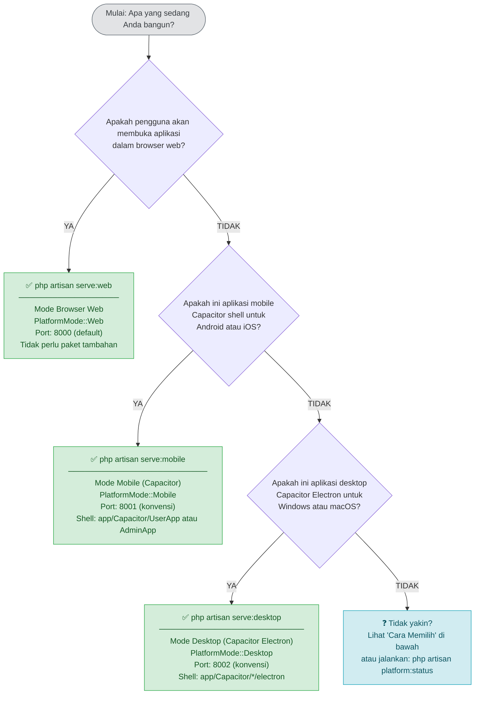

# Pohon Keputusan Penggunaan Perintah (Capacitor)

Dokumen ini membantu Anda memilih perintah Artisan yang tepat untuk platform target
Anda dan menyediakan panduan pemecahan masalah untuk error paling umum.

> **Catatan:** Aplikasi mobile dan desktop sekarang menggunakan **shell Capacitor**
> (WebView loader), bukan NativePHP. Server Laravel sama untuk semua platform —
> perbedaan hanya file `.env.{mode}` dan bundle Vite `public/build/{web,mobile,desktop}`.

---

## Diagram Alur Keputusan



---

## Fallback ASCII

```
┌──────────────────────────────────────────────────────────────────────┐
│               Platform apa yang Anda targetkan?                      │
└──────────────────────────────────────────────────────────────────────┘
                                 │
          ┌──────────────────────┼──────────────────────┐
          │                      │                      │
          ▼                      ▼                      ▼
     Browser web?          Android / iOS          Windows / macOS
                          Capacitor shell?          Capacitor Electron?
          │                      │                      │
          │                      │                      │
          ▼                      ▼                      ▼
    php artisan          php artisan            php artisan
       serve:web            serve:mobile           serve:desktop
```

---

## Cara Memilih

### Gunakan `php artisan serve:web` ketika…

- Anda mengembangkan aplikasi web standar yang diakses melalui browser.
- Anda ingin menjalankan aplikasi di server remote yang dapat diakses via URL.
- Anda memerlukan akses kamera berbasis **WebRTC** (`getUserMedia` browser).
- Anda menguji panel admin Filament atau dasbor pengguna.
- Anda **tidak** memerlukan integrasi OS native.

```bash
php artisan serve:web
# Default: http://localhost:8000
```

Tidak diperlukan paket Composer tambahan. Ini adalah alur kerja Laravel standar.

---

### Gunakan `php artisan serve:mobile` ketika…

- Anda menjalankan shell Capacitor mobile (`app/Capacitor/UserApp` atau `AdminApp`) di Android/iOS.
- Aplikasi akan dibangun sebagai **APK/AAB** (Google Play) atau **IPA** (App Store) via Capacitor.
- Anda memerlukan kamera via input file tersembunyi (shell membuka `<input type="file" capture>`).
- Anda memerlukan **Push Notifications** via FCM (saat app background).
- Aplikasi harus dapat diakses via emulator (`http://10.0.2.2:8001`) atau perangkat fisik via LAN.

```bash
php artisan serve:mobile --port=8001
```

**Yang dibutuhkan di shell (bukan di server):**
- `app/Capacitor/UserApp` atau `AdminApp` sudah `npm install` dan `cap sync`
- `capacitor.config.json` → `server.url` menunjuk ke URL server ini
- Android SDK / Xcode untuk build native

---

### Gunakan `php artisan serve:desktop` ketika…

- Anda menjalankan shell Capacitor Electron (`app/Capacitor/*/electron`) di Windows/macOS.
- Aplikasi akan dibangun sebagai **`.exe` NSIS** (Windows) atau **`.dmg`** (macOS) via `electron-builder`.
- Anda memerlukan **Web Notifications API** (standar browser, tersedia di Electron).
- Anda memerlukan **auto-updater** via `electron-updater`.
- Jendela aplikasi harus berperilaku seperti program desktop native.

```bash
php artisan serve:desktop --port=8002
```

**Yang dibutuhkan di shell (bukan di server):**
- `app/Capacitor/UserApp/electron` atau `AdminApp/electron` sudah `npm install`
- `electron-builder` dikonfigurasi di `electron/electron-builder.config.js`
- Sertifikat Authenticode (Windows) / Developer ID (macOS) untuk distribusi

---

## Perbandingan Perintah Sekilas

| | `serve:web` | `serve:mobile` | `serve:desktop` |
|---|---|---|---|
| **Lingkungan target** | Browser web | Android / iOS (Capacitor) | Windows / macOS (Capacitor Electron) |
| **PlatformMode** | `Web` | `Mobile` | `Desktop` |
| **Port konvensi** | 8000 | 8001 | 8002 |
| **Paket Composer tambahan** | Tidak ada | Tidak ada | Tidak ada |
| **API Kamera** | WebRTC `getUserMedia` | Shell: `<input capture>` | Shell: `<input capture>` |
| **File override env** | `.env.web` | `.env.mobile` | `.env.desktop` |
| **Direktori aset** | `public/build/web` | `public/build/mobile` | `public/build/desktop` |
| **Driver sesi** | `cookie` | `database` | `file` |
| **Push Notifications** | ❌ | ✅ FCM | ❌ |
| **Desktop Notifications** | ❌ (pakai Web Notif API) | ❌ | ✅ Web Notif API |
| **Auto-updater** | ❌ | ❌ | ✅ `electron-updater` |

> **Semua tiga perintah mendelegasikan ke `php artisan serve` internal.**
> Lihat `app/Console/Commands/ServePlatformCommand/DelegatesToServeCommand.php`.

---

## Sebelum Menjalankan Perintah Mana Pun

### 1. Kompilasi aset untuk platform target

```bash
npm run build:web       # sebelum php artisan serve:web
npm run build:mobile    # sebelum php artisan serve:mobile
npm run build:desktop   # sebelum php artisan serve:desktop
```

Selama pengembangan, gunakan server dev HMR:

```bash
npm run dev:web        # VITE_PLATFORM=web
npm run dev:mobile     # VITE_PLATFORM=mobile
npm run dev:desktop    # VITE_PLATFORM=desktop
```

### 2. Salin file lingkungan platform (direkomendasikan)

```bash
cp .env.web.example .env.web
cp .env.mobile.example .env.mobile
cp .env.desktop.example .env.desktop
```

Sesuaikan setiap file. Minimal tetapkan `APP_URL` dengan benar:
- `.env.web`: `APP_URL=http://localhost:8000`
- `.env.mobile`: `APP_URL=http://10.0.2.2:8001` (emulator) atau LAN IP
- `.env.desktop`: `APP_URL=http://localhost:8002`

### 3. Periksa status aktif kapan saja

```bash
php artisan platform:status
```

Menampilkan mode terdeteksi, runtime platform, file env yang dimuat, direktori aset, dan fitur tersedia.

---

## Pemecahan Masalah

### Error: Aset Tidak Ditemukan (404 JS/CSS atau Halaman Kosong)

**Gejala:**
```
GET /build/mobile/assets/app-mobile.abc12345.js  404 Not Found
```

**Penyebab:** Aset tidak dikompilasi untuk mode aktif, atau direktori build salah dibaca.

**Solusi:**
```bash
npm run build:web       # untuk serve:web
npm run build:mobile    # untuk serve:mobile
npm run build:desktop   # untuk serve:desktop
```

**Diagnosa:**
```bash
php artisan platform:status
# "Asset directory: public/build/<platform>"
# "Manifest exists: true/false"
```

---

### Error: File Lingkungan Platform Tidak Diterapkan

**Gejala:** Pengaturan dari `.env.mobile` / `.env.desktop` tidak berlaku.

**Penyebab:** File tidak ada di root proyek, atau nama/casing salah.

**Solusi:**
```bash
ls -la .env*
# Diharapkan: .env  .env.web  .env.mobile  .env.desktop

cp .env.web.example .env.web
cp .env.mobile.example .env.mobile
cp .env.desktop.example .env.desktop
```

Kesalahan umum:
- File di subdirektori (harus root proyek).
- Casing salah: `.env.mobile` bukan `.env.Mobile`.
- Hanya `.example` yang disalin, tidak di-rename.

---

### Error: Alamat Sudah Digunakan (Port Conflict)

**Gejala:**
```
Failed to listen on 127.0.0.1:8000 (reason: Address already in use)
```

**Solusi — temukan dan hentikan proses konflik:**
```bash
# Windows
netstat -ano | findstr :8000
taskkill /PID <pid> /F

# macOS / Linux
lsof -i :8000
kill -9 <pid>
```

**Solusi — gunakan port berbeda:**
```bash
php artisan serve:web --port=8080
php artisan serve:mobile --port=8003
php artisan serve:desktop --port=8004
```

---

### Error: Platform Selalu Terdeteksi sebagai Web (`WebsiteWindows`)

**Gejala:** `php artisan platform:status` menampilkan `PlatformMode: Web` meskipun menjalankan `serve:mobile` atau `serve:desktop`.

**Penyebab:** `PlatformCommandDetector` membaca `$_SERVER['argv']`. Deteksi jatuh ke Web ketika:
- Nama perintah di `argv[1]` tidak cocok `serve:web|serve:mobile|serve:desktop|serve`.
- Proses bukan lewat Artisan CLI (queue worker, scheduler).
- `PLATFORM_MODE` env tidak diset untuk proses non-CLI.

**Solusi:**
1. Periksa log:
```bash
tail -n 50 storage/logs/laravel.log | grep "Platform detection"
```

2. Untuk proses non-CLI (worker, scheduler), set `PLATFORM_MODE`:
```bash
# Supervisor config example
[program:laravel-queue-mobile]
command=php artisan queue:work --queue=default
environment=PLATFORM_MODE="mobile"
```

3. Bersihkan cache platform basi:
```bash
php artisan platform:clear
```

---

### Error: Shell Capacitor Menampilkan Halaman Putih / Tidak Bisa Konek

**Gejala:** Aplikasi mobile/desktop terbuka tapi putih kosong atau error koneksi.

**Diagnosa:**
```bash
# 1. Server Laravel hidup dan reachable?
curl -I http://10.0.2.2:8001/user   # mobile emulator
curl -I http://localhost:8002/user  # desktop

# 2. Aset platform ada?
ls public/build/mobile/.vite/manifest.json
ls public/build/desktop/.vite/manifest.json

# 3. capacitor.config.json URL benar?
cat app/Capacitor/UserApp/capacitor.config.json
# "server": { "url": "http://10.0.2.2:8001/user", ... }

# 4. Cleartext diizinkan untuk http dev?
# "cleartext": true  (hanya untuk http dev)
```

**Solusi:**
```bash
# Build aset
npm run build:mobile
npm run build:desktop

# Set URL shell ke server yang benar
cd app/Capacitor/UserApp && npm run set:url -- http://10.0.2.2:8001/user

# Sync Capacitor
cd app/Capacitor/UserApp && npm run sync
```

---

### Error: Kamera Tidak Muncul di Shell Mobile

**Gejala:** Tombol kamera diklik tapi tidak ada input file yang terbuka.

**Penyebab:** Listener Alpine `capacitor-camera-open-input` tidak terpasang, atau event tidak di-dispatch.

**Periksa:**
- `CbirSearchPage` dispatch `capacitor-camera-open-input`?
- Partial `cbir-camera-options` punya `x-on:capacitor-camera-open-input.window`?
- Input tersembunyi `photo` dan `photoFront` ada di partial?

**Referensi kode:**
- `app/Filament/User/Pages/CbirSearchPage/CbirSearchPage.php` → dispatch
- `resources/views/User/components/cbir-camera-options/cbir-camera-options.blade.php` → listener + input

---

### Error: Push Notification FCM Tidak Masuk di Mobile

**Gejala:** Notifikasi database + broadcast masuk, tapi FCM tidak saat app background.

**Periksa:**
- `fcm_token` tersimpan di tabel `users`?
- `FIREBASE_CREDENTIALS` / `FCM_SERVER_KEY` dikonfigurasi?
- `PlatformNotificationService::send()` memanggil `sendFcmPush()`?

---

## Kartu Referensi Cepat

```
APA YANG ANDA BUTUHKAN?                  PERINTAH YANG DIJALANKAN
─────────────────────────────────        ─────────────────────────────
Layani ke browser web                    php artisan serve:web
Jalankan server untuk shell mobile       php artisan serve:mobile
Jalankan server untuk shell desktop      php artisan serve:desktop
Periksa mode platform aktif              php artisan platform:status
Bersihkan cache platform / state basi    php artisan platform:clear
Build aset web                           npm run build:web
Build aset mobile                        npm run build:mobile
Build aset desktop                       npm run build:desktop
Build semua platform                     npm run build:all
Set URL shell mobile/user                cd app/Capacitor/UserApp && npm run set:url -- <URL>
Set URL shell admin                      cd app/Capacitor/AdminApp && npm run set:url -- <URL>
Sync shell mobile (android/ios)          cd app/Capacitor/UserApp && npm run sync
Build installer Windows (di shell)       cd app/Capacitor/UserApp && npx electron-builder --win
Build DMG macOS (di shell)               cd app/Capacitor/UserApp && npx electron-builder --mac
```

---

## Lihat Juga

- [Arsitektur Dukungan Platform](../platform-support/platform-support.md) — ikhtisar komponen, alur data, enum RuntimePlatform
- [Strategi Konfigurasi Lingkungan](../environment-configuration/environment-configuration.md) — struktur file `.env.*` dan aturan penggabungan
- [Proses Kompilasi Aset](../asset-compilation/asset-compilation.md) — pipeline build Vite dan pengaturan HMR
- [Matriks Fitur Platform](../platform-features/platform-features.md) — ketersediaan fitur per platform dan cara memeriksanya
- [Panduan Perintah Lengkap](../command-guide/command-guide.md) — referensi perintah detail dengan semua flag dan opsi
- [Panduan Deployment Mobile](../deployment/mobile/mobile.md) — build APK/AAB/IPA
- [Panduan Deployment Desktop](../deployment/desktop/desktop.md) — build .exe/.dmg