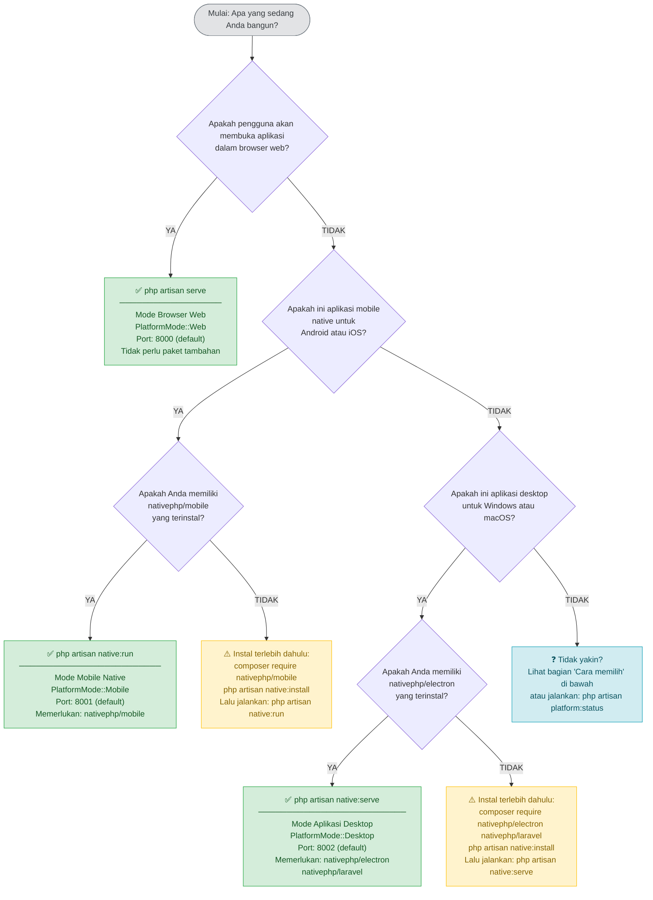

# Pohon Keputusan Penggunaan Perintah

Dokumen ini membantu Anda memilih perintah Artisan yang tepat untuk platform target Anda dan menyediakan panduan pemecahan masalah untuk error paling umum.

---

## Diagram Alur Keputusan

Gunakan diagram alur ini untuk memilih perintah yang tepat. Ikuti panah dari atas hingga Anda mencapai kotak perintah.



---

## Fallback ASCII

Jika renderer Markdown Anda tidak mendukung Mermaid, gunakan versi ASCII ini:

```
┌──────────────────────────────────────────────────────────────────────┐
│               Platform apa yang Anda targetkan?                      │
└──────────────────────────────────────────────────────────────────────┘
                                │
         ┌──────────────────────┼──────────────────────┐
         │                      │                      │
         ▼                      ▼                      ▼
   Browser web?          Android / iOS          Windows / macOS
                         app native?            app desktop?
         │                      │                      │
         │               nativephp/mobile         nativephp/electron
         │               terinstal?               nativephp/laravel
         │                 /    \                  terinstal?
         │               YA     TIDAK              /    \
         │                │      │               YA     TIDAK
         │                │      ▼                │      │
         │                │  composer require     │      ▼
         │                │  nativephp/mobile     │  composer require
         │                │  (lalu coba lagi)     │  nativephp/electron
         │                │                       │  nativephp/laravel
         │                │                       │  (lalu coba lagi)
         ▼                ▼                       ▼
  php artisan      php artisan             php artisan
     serve           native:run             native:serve
```

---

## Cara Memilih

### Gunakan `php artisan serve` ketika…

- Anda sedang mengembangkan aplikasi web standar yang diakses melalui browser.
- Anda ingin menjalankan aplikasi di server remote yang dapat diakses melalui URL.
- Anda memerlukan akses kamera berbasis WebRTC (browser `getUserMedia`).
- Anda menguji panel admin Filament atau dasbor pengguna.
- Anda tidak memerlukan integrasi OS native (sistem file, push notification, system tray).

```bash
php artisan serve
# Default: http://localhost:8000
```

Tidak diperlukan paket Composer tambahan. Ini adalah alur kerja Laravel standar.

---

### Gunakan `php artisan native:run` ketika…

- Anda membangun aplikasi mobile native yang akan didistribusikan di **Google Play Store** atau **Apple App Store**.
- Anda memerlukan API mobile native: kamera, push notification, autentikasi biometrik, badge aplikasi.
- Aplikasi akan diinstal langsung di ponsel/tablet Android atau iPhone/iPad.
- Anda memerlukan sesi yang bertahan saat aplikasi di-restart (gunakan `SESSION_DRIVER=database`).

```bash
php artisan native:run          # deteksi otomatis perangkat
php artisan native:run android  # hanya Android
php artisan native:run ios      # hanya iOS (memerlukan macOS)
```

**Paket yang diperlukan:** `nativephp/mobile`

---

### Gunakan `php artisan native:serve` ketika…

- Anda membangun aplikasi desktop yang akan berjalan sebagai **`.exe` native** (Windows) atau **`.app`** (macOS).
- Anda memerlukan Electron APIs: notifikasi desktop, akses sistem file, pembaruan otomatis, system tray.
- Jendela aplikasi harus berperilaku seperti program desktop native (bukan tab browser).
- Anda memerlukan akses sistem file lokal pengguna tunggal.

```bash
php artisan native:serve
```

**Paket yang diperlukan:** `nativephp/electron`, `nativephp/laravel`

---

## Perbandingan Perintah Sekilas

| | `artisan serve` | `artisan native:run` | `artisan native:serve` |
|---|---|---|---|
| Lingkungan target | Browser web | Android / iOS | Desktop Windows / macOS |
| PlatformMode | `Web` | `Mobile` | `Desktop` |
| Port default | 8000 | 8001 | 8002 |
| Paket tambahan | Tidak ada | `nativephp/mobile` | `nativephp/electron` + `nativephp/laravel` |
| API Kamera | WebRTC getUserMedia | NativePHP Mobile Camera | NativePHP Electron Camera |
| File override env | `.env.web` | `.env.mobile` | `.env.desktop` |
| Direktori aset | `public/build/web` | `public/build/mobile` | `public/build/desktop` |
| Driver sesi | `cookie` | `database` | `file` |
| Rute khusus platform | `routes/web.php` | `routes/mobile.php` | `routes/desktop.php` |

---

## Sebelum Menjalankan Perintah Mana Pun

### 1. Kompilasi aset untuk platform target

```bash
npm run build:web      # sebelum php artisan serve
npm run build:mobile   # sebelum php artisan native:run
npm run build:desktop  # sebelum php artisan native:serve
```

Selama pengembangan, gunakan server dev HMR sebagai gantinya:

```bash
npm run dev:web        # port 5173
npm run dev:mobile     # port 5174
npm run dev:desktop    # port 5175
```

### 2. Salin file lingkungan platform (opsional namun direkomendasikan)

```bash
cp .env.web.example .env.web
cp .env.mobile.example .env.mobile
cp .env.desktop.example .env.desktop
```

Sesuaikan setiap file untuk platformnya. Minimal, tetapkan `APP_URL` dan `APP_PORT` dengan benar.

### 3. Periksa status aktif kapan saja

```bash
php artisan platform:status
```

Menampilkan mode yang terdeteksi, runtime platform, file lingkungan yang dimuat, direktori aset, dan fitur yang tersedia.

---

## Pemecahan Masalah

### Error: Dependensi NativePHP yang Hilang

**Gejala**

```
Error: Required dependencies for Mobile Native mode are not installed.

Missing packages:
  - nativephp/mobile

To install, run:
  composer require nativephp/mobile
```

**Penyebab:** `native:run` atau `native:serve` dieksekusi sebelum paket Composer yang diperlukan diinstal.

**Solusi**

```bash
# Mode Mobile
composer require nativephp/mobile
php artisan native:install

# Mode Desktop
composer require nativephp/electron nativephp/laravel
php artisan native:install
```

**Tips:** Gunakan perintah wrapper validasi untuk menangkap paket yang hilang sebelum memulai:

```bash
php artisan platform:native:run     # memvalidasi lalu meneruskan ke native:run
php artisan platform:native:serve   # memvalidasi lalu meneruskan ke native:serve
```

---

### Error: Alamat Sudah Digunakan (Port Salah)

**Gejala**

```
Failed to listen on 127.0.0.1:8000 (reason: Address already in use)
```

Atau aplikasi NativePHP membuka jendela kosong tanpa error.

**Penyebab:** Proses lain sudah terikat ke port.

**Solusi — temukan dan hentikan proses yang konflik**

```bash
# Windows
netstat -ano | findstr :8000
taskkill /PID <pid> /F

# macOS / Linux
lsof -i :8000
kill -9 <pid>
```

**Solusi — gunakan port yang berbeda**

```bash
php artisan serve --port=8080
```

Untuk mode NativePHP, edit file lingkungan yang relevan:

```dotenv
# .env.mobile
APP_PORT=8001

# .env.desktop
NATIVEPHP_HTTP_PORT=8002
APP_URL=http://localhost:8002
```

---

### Error: File Lingkungan Platform Tidak Diterapkan

**Gejala:** Pengaturan khusus platform (`SESSION_DRIVER`, `APP_URL`, dll.) dari `.env.mobile` atau `.env.desktop` tidak berlaku, bahkan setelah membuat file tersebut.

**Entri log:**

```
[debug] Platform environment file not found, using base environment
        {"file":".env.mobile","mode":"mobile"}
```

**Penyebab:** File tidak ada di root proyek, atau memiliki nama/casing yang salah.

**Solusi**

```bash
# Verifikasi file ada di root proyek (level yang sama dengan composer.json)
ls -la .env*
# Diharapkan: .env  .env.web  .env.mobile  .env.desktop

# Buat dari contoh jika tidak ada
cp .env.web.example .env.web
cp .env.mobile.example .env.mobile
cp .env.desktop.example .env.desktop
```

Kesalahan umum:

- File ditempatkan di dalam subdirektori (harus berada di root proyek).
- Casing salah — nama file harus huruf kecil: `.env.mobile`, bukan `.env.Mobile`.
- Hanya file `.example` yang dibuat tetapi tidak diubah namanya.

---

### Error: Aset Tidak Ditemukan (404 pada JS/CSS atau Halaman Kosong)

**Gejala**

```
GET /build/mobile/assets/app-mobile.abc12345.js  404 Not Found
```

Atau halaman dimuat dengan gaya yang hilang / error manifest Vite di konsol browser.

**Penyebab:** Aset tidak dikompilasi untuk mode platform aktif, atau direktori build platform yang berbeda sedang dibaca.

**Solusi**

```bash
# Kompilasi untuk platform yang Anda layani
npm run build:web      # untuk php artisan serve
npm run build:mobile   # untuk php artisan native:run
npm run build:desktop  # untuk php artisan native:serve
```

**Diagnosa:** Periksa jalur manifest mana yang dibaca aplikasi:

```bash
php artisan platform:status
# Output mencakup: "Asset directory: public/build/<platform>"
# dan apakah manifest.json ada di jalur tersebut
```

---

### Error: Platform Selalu Terdeteksi sebagai Web (Unexpected `WebsiteWindows`)

**Gejala:** `php artisan platform:status` menampilkan `PlatformMode: Web` meskipun Anda memulai aplikasi dengan `native:run` atau `native:serve`. Kamera native dan notifikasi tidak tersedia.

**Penyebab:** `PlatformCommandDetector` membaca `$_SERVER['argv']` untuk mengidentifikasi perintah Artisan. Deteksi jatuh kembali ke mode Web ketika:

- Nama perintah di `argv[1]` tidak cocok persis dengan `serve`, `native:run`, atau `native:serve`.
- Aplikasi tidak dimulai melalui Artisan CLI (mis. proses PHP langsung).
- Variabel lingkungan runtime native (`NATIVEPHP_RUNNING`, `NATIVE_MOBILE_RUNNING`) tidak diatur.

**Solusi**

1. Periksa log untuk entri warning:

   ```bash
   tail -n 50 storage/logs/laravel.log | grep "Platform detection"
   ```

2. Pastikan variabel env runtime native diatur dalam file env platform:

   ```dotenv
   # .env.desktop (NativePHP Electron mengaturnya secara otomatis)
   NATIVEPHP_RUNNING=true

   # .env.mobile (NativePHP Mobile mengaturnya secara otomatis)
   NATIVE_MOBILE_RUNNING=true
   ```

3. Bersihkan cache platform yang basi:

   ```bash
   php artisan platform:clear
   ```

4. Jalankan ulang perintah langsung dari terminal daripada melalui launcher IDE yang mungkin mengubah `argv`.

---

### Error: Perintah `native:run` atau `native:serve` Tidak Ditemukan

**Gejala**

```
Command "native:run" is not defined.
```

**Penyebab:** Paket NativePHP tidak terinstal dan belum mendaftarkan perintah Artisan-nya.

**Solusi**

```bash
# Untuk native:run
composer require nativephp/mobile

# Untuk native:serve
composer require nativephp/electron nativephp/laravel

# Kemudian instal scaffolding NativePHP
php artisan native:install
```

---

### Error: Build iOS Gagal — Xcode / devicectl Tidak Ditemukan

**Gejala**

```
Error: Xcode command line tools not found.
```

Atau `native:run ios` keluar segera tanpa men-deploy.

**Penyebab:** Build iOS memerlukan macOS dengan Xcode yang terinstal.

**Solusi**

- Instal Xcode dari Mac App Store.
- Terima lisensi Xcode: `sudo xcodebuild -license accept`.
- Instal command line tools: `xcode-select --install`.
- Pastikan `devicectl` tersedia: `xcrun devicectl --version`.

Build iOS **hanya bisa di macOS**. Gunakan emulator Android di Windows/Linux untuk pengujian mobile lintas platform.

---

### Error: Jendela Electron Terbuka tetapi Menampilkan Halaman Putih Kosong

**Gejala:** Aplikasi NativePHP Electron terbuka, tetapi jendela kosong atau menampilkan error koneksi.

**Penyebab:** Server PHP tertanam gagal dimulai, atau aset tidak dikompilasi untuk platform desktop.

**Langkah diagnosis:**

```bash
# 1. Periksa log Laravel untuk error startup
tail -n 100 storage/logs/laravel.log

# 2. Verifikasi aset desktop ada
ls public/build/desktop/

# 3. Periksa apakah port 8002 bebas
lsof -i :8002       # macOS/Linux
netstat -ano | findstr :8002   # Windows

# 4. Periksa status platform aktif
php artisan platform:status
```

**Solusi**

```bash
# Kompilasi aset desktop
npm run build:desktop

# Bersihkan cache platform dan coba lagi
php artisan platform:clear
php artisan native:serve
```

---

### Error: Route Tidak Ditemukan (404) untuk Endpoint Mobile atau Desktop

**Gejala:** Request ke `/api/mobile/camera/capture` atau `/api/desktop/file/save` mengembalikan 404.

**Penyebab:** Rute khusus platform hanya didaftarkan saat mode platform yang sesuai aktif. Mengakses rute mobile dari browser web atau aplikasi desktop mengembalikan 404 sesuai desain.

**Perilaku yang diharapkan:**

| Prefiks rute | Hanya dapat diakses dari |
|---|---|
| `/api/mobile/*` | `php artisan native:run` |
| `/api/desktop/*` | `php artisan native:serve` |

**Solusi:** Pastikan Anda memulai server dengan perintah yang benar untuk rute yang Anda uji.

**Debug:** Daftarkan semua rute yang terdaftar untuk mode saat ini:

```bash
php artisan route:list --path=api/mobile
php artisan route:list --path=api/desktop
```

Jika rute tidak muncul, mode platform tidak terdeteksi dengan benar. Jalankan `php artisan platform:status` dan periksa mode yang dilaporkan.

---

## Kartu Referensi Cepat

```
APA YANG ANDA BUTUHKAN?                  PERINTAH YANG DIJALANKAN
─────────────────────────────────        ─────────────────────────────
Layani ke browser web                    php artisan serve
Deploy ke perangkat Android              php artisan native:run android
Deploy ke perangkat iOS                  php artisan native:run ios
Jalankan sebagai app desktop (Win/Mac)   php artisan native:serve
Periksa mode platform aktif              php artisan platform:status
Bersihkan cache platform / state basi    php artisan platform:clear
Validasi dependensi mobile               php artisan platform:native:run
Validasi dependensi desktop              php artisan platform:native:serve
```

---

## Lihat Juga

- [Arsitektur Dukungan Platform](./platform-support.md) — ikhtisar komponen, alur data, enum RuntimePlatform
- [Strategi Konfigurasi Lingkungan](./environment-configuration.md) — struktur file `.env.*` dan aturan penggabungan
- [Proses Kompilasi Aset](./asset-compilation.md) — pipeline build Vite dan pengaturan HMR
- [Matriks Fitur Platform](./platform-features.md) — ketersediaan fitur per platform dan cara memeriksanya
- [Panduan Perintah Lengkap](./command-guide.md) — referensi perintah detail dengan semua flag dan opsi
