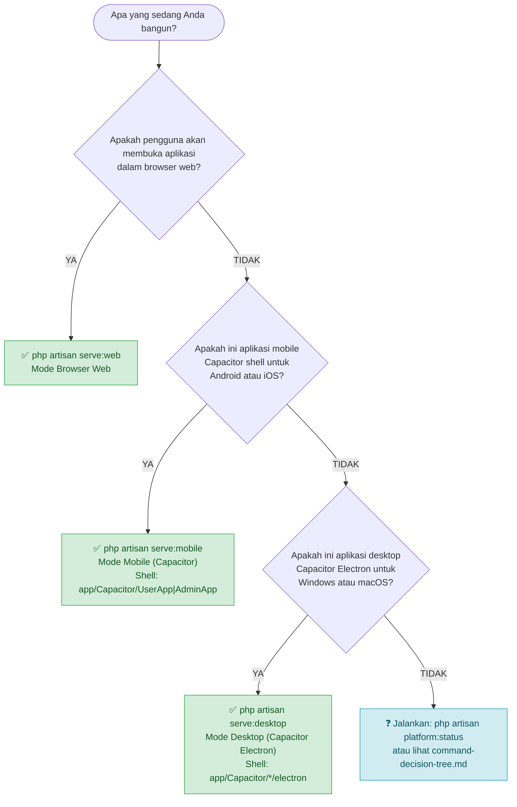

# Panduan Penggunaan Perintah (Capacitor)

Panduan ini menjelaskan perintah Artisan untuk platform target Anda, apa yang
dibutuhkan setiap perintah, dan referensi pemecahan masalah.

> **Catatan:** Aplikasi mobile dan desktop sekarang menggunakan **shell Capacitor**
> (WebView loader), bukan NativePHP. Server Laravel sama untuk semua platform —
> perbedaan hanya file `.env.{mode}` dan bundle Vite `public/build/{web,mobile,desktop}`.

---

## Pohon Keputusan Cepat



Masih bingung? Tanyakan pada diri sendiri:

1. **Apakah pengguna akan membuka aplikasi di browser (Chrome, Safari, Firefox)?**
   → `php artisan serve:web`

2. **Apakah aplikasi akan diinstal di ponsel Android atau iPhone/iPad via Capacitor?**
   → `php artisan serve:mobile`

3. **Apakah aplikasi akan dikirimkan sebagai program desktop `.exe` (Windows) atau `.dmg` (macOS) via Capacitor Electron?**
   → `php artisan serve:desktop`

---

## Referensi Perintah

### `php artisan serve:web` — Mode Browser Web

Memulai server HTTP pengembangan Laravel standar di `http://localhost:8000`.

```bash
php artisan serve:web

# Ganti port
php artisan serve:web --port=8080

# Dengarkan di semua antarmuka (berguna untuk akses LAN)
php artisan serve:web --host=0.0.0.0 --port=8000
```

**Mode platform yang diinisialisasi:** `PlatformMode::Web`

**Kasus RuntimePlatform yang terdeteksi pada waktu request:**

| User Agent | Kasus RuntimePlatform |
|------------|---------------------|
| Browser Windows / Linux | `WebsiteWindows` |
| Browser macOS | `WebsiteMacOS` |
| Browser Android | `WebsiteAndroid` |
| Browser iPhone / iPad | `WebsiteIos` |

**Yang dikonfigurasi secara otomatis:**

- Lingkungan: menggabungkan `.env.web` (jika ada) di atas `.env`
- Aset: membaca `public/build/web/manifest.json`
- Driver sesi: `cookie` (ketika `.env.web` memiliki `SESSION_DRIVER=cookie`)
- Kamera: WebRTC `getUserMedia` API

**Prasyarat:**

- PHP 8.2+ CLI
- Dependensi Composer terinstal (`composer install`)
- Aset web dikompilasi (`npm run build:web`) — atau server dev Vite berjalan (`npm run dev:web`)
- File `.env` ada di root proyek
- Opsional: `.env.web` untuk override khusus web

Tidak diperlukan paket Composer tambahan di luar instalasi Laravel standar.

---

### `php artisan serve:mobile` — Mode Mobile (Capacitor Shell)

Menjalankan server Laravel yang diload oleh shell Capacitor mobile
(`app/Capacitor/UserApp` atau `AdminApp`) di Android/iOS.

```bash
php artisan serve:mobile --port=8001
```

**Mode platform yang diinisialisasi:** `PlatformMode::Mobile`

**Kasus RuntimePlatform yang dihasilkan:**

- `MobileAppAndroid` — perangkat atau emulator Android
- `MobileAppIos` — iPhone atau iPad

**Yang dikonfigurasi secara otomatis:**

- Lingkungan: menggabungkan `.env.mobile` (jika ada) di atas `.env`
- Aset: membaca `public/build/mobile/manifest.json`
- Driver sesi: `database` (direkomendasikan untuk mobile — bertahan saat aplikasi di-restart)
- Kamera: shell membuka `<input type="file" capture>` (bukan WebRTC)
- Push Notifications: FCM (saat app background)

**Prasyarat (di SERVER):**

| Persyaratan | Detail |
|-------------|---------| 
| Aset mobile dikompilasi | `npm run build:mobile` (atau `npm run dev:mobile` untuk HMR) |
| `.env.mobile` | Override `APP_URL`, `SESSION_DRIVER=database`, `VITE_PLATFORM=mobile` |

**Prasyarat (di SHELL — `app/Capacitor/UserApp` atau `AdminApp`):**

| Persyaratan | Detail |
|-------------|---------| 
| Node.js 18+ | `npm install` sudah dijalankan |
| `capacitor.config.json` → `server.url` | Menunjuk ke URL server ini (mis. `http://10.0.2.2:8001/user`) |
| Android SDK + ADB | Diperlukan untuk `cap run android` / build APK |
| Xcode + `devicectl` | Diperlukan untuk `cap run ios` / build IPA; hanya macOS |
| `cap sync` sudah dijalankan | Menyalin `dist/` ke project native |

> Server dan shell **terpisah**. Build shell (`npx cap run android`) dilakukan
> di folder shell, bukan di server.

---

### `php artisan serve:desktop` — Mode Desktop (Capacitor Electron)

Menjalankan server Laravel yang diload oleh shell Capacitor Electron
(`app/Capacitor/UserApp/electron` atau `AdminApp/electron`) di Windows/macOS.

```bash
php artisan serve:desktop --port=8002

# Lewati queue worker
php artisan serve:desktop --without-queue

# Lewati scheduler
php artisan serve:desktop --without-schedule

# Sembunyikan output log Laravel dari konsol
php artisan serve:desktop --quiet-logs
```

**Mode platform yang diinisialisasi:** `PlatformMode::Desktop`

**Kasus RuntimePlatform yang dihasilkan:**

- `DesktopAppWindows` — PC Windows
- `DesktopAppMacOS` — macOS

**Yang dikonfigurasi secara otomatis:**

- Lingkungan: menggabungkan `.env.desktop` (jika ada) di atas `.env`
- Aset: membaca `public/build/desktop/manifest.json`
- Driver sesi: `file` (proses lokal pengguna tunggal)
- Kamera: shell membuka `<input type="file" capture>` (bukan WebRTC)
- Desktop Notifications: Web Notifications API (standar browser, tersedia di Electron)
- Auto-updater: `electron-updater` (di shell, bukan server)

**Prasyarat (di SERVER):**

| Persyaratan | Detail |
|-------------|---------| 
| Aset desktop dikompilasi | `npm run build:desktop` (atau `npm run dev:desktop` untuk HMR) |
| `.env.desktop` | Override `APP_URL`, `SESSION_DRIVER=file`, `VITE_PLATFORM=desktop` |

**Prasyarat (di SHELL — `app/Capacitor/*/electron`):**

| Persyaratan | Detail |
|-------------|---------| 
| Node.js 18+ | `npm install` sudah dijalankan |
| Electron 43+ | Sudah di `package.json` |
| `electron-builder` | Untuk build `.exe`/`.dmg` |
| Sertifikat Authenticode / Developer ID | Untuk distribusi produksi |

---

## Perbandingan Berdampingan

| | `serve:web` | `serve:mobile` | `serve:desktop` |
|---|---|---|---|
| **Target** | Browser web | Android / iOS (Capacitor) | Windows / macOS (Capacitor Electron) |
| **PlatformMode** | `Web` | `Mobile` | `Desktop` |
| **RuntimePlatform** | WebsiteWindows/MacOS/Android/Ios | MobileAppAndroid/Ios | DesktopAppWindows/MacOS |
| **File override env** | `.env.web` | `.env.mobile` | `.env.desktop` |
| **Direktori aset** | `public/build/web` | `public/build/mobile` | `public/build/desktop` |
| **API Kamera** | WebRTC `getUserMedia` | Shell: `<input capture>` | Shell: `<input capture>` |
| **Port konvensi** | 8000 | 8001 | 8002 |
| **Paket Composer tambahan** | Tidak ada | Tidak ada | Tidak ada |
| **Push Notifications** | ❌ | ✅ FCM | ❌ |
| **Desktop Notifications** | Web Notif API | ❌ | Web Notif API (Electron) |
| **Auto-updater** | ❌ | ❌ | ✅ `electron-updater` (shell) |

> **Semua tiga perintah mendelegasikan ke `php artisan serve` internal.**
> Lihat `app/Console/Commands/ServePlatformCommand/DelegatesToServeCommand.php`.

---

## Alur Kerja Pengembangan yang Direkomendasikan

Tiga terminal, satu per platform, port berbeda:

### Terminal 1 — Web (port 8000)

```bash
npm run dev:web
php artisan serve:web --port=8000
```

### Terminal 2 — Mobile (port 8001)

```bash
npm run dev:mobile
php artisan serve:mobile --port=8001
# Di shell terpisah:
cd app/Capacitor/UserApp && npm run android   # atau ios
```

### Terminal 3 — Desktop (port 8002)

```bash
npm run dev:desktop
php artisan serve:desktop --port=8002
# Di shell terpisah:
cd app/Capacitor/UserApp && npx electron-builder --config electron/electron-builder.config.js --dir
```

### Konvensi Penugasan Port

| Platform | Port Laravel | Port Vite HMR |
|----------|-------------|--------------|
| Web | 8000 | 5173 |
| Mobile | 8001 | 5174 |
| Desktop | 8002 | 5175 |

Port diatur di `.env.web`, `.env.mobile`, `.env.desktop`. Override port Vite:

```bash
VITE_PORT=5200 npm run dev:web
```

### Periksa Apa yang Sedang Aktif

```bash
php artisan platform:status
```

### Beralih Mode Selama Pengembangan

```bash
php artisan platform:clear
```

---

## Referensi Perintah Build

```bash
# Build hanya bundel web
npm run build:web

# Build hanya bundel mobile
npm run build:mobile

# Build hanya bundel desktop
npm run build:desktop

# Build ketiganya secara berurutan
npm run build:all
```

Direktori output:

```
public/
  build/
    web/        ← serve:web
    mobile/     ← serve:mobile
    desktop/    ← serve:desktop
```

---

## Shell Capacitor: Perintah Build & Deploy

> Perintah di bawah ini dijalankan **di dalam folder shell**, bukan di root server.

### Mobile (Android)

```bash
cd app/Capacitor/UserApp
npm run build              # Vite build → dist/
npx cap sync android       # Copy dist + update native project
npx cap run android        # Deploy ke emulator/device
npx cap run android --watch # Hot reload (dev)
```

### Mobile (iOS — hanya macOS)

```bash
cd app/Capacitor/UserApp
npm run build
npx cap sync ios
npx cap run ios
```

### Desktop (Windows)

```bash
cd app/Capacitor/UserApp
npm run build
npx tsc -p electron/tsconfig.json
npx electron-builder --config electron/electron-builder.config.js --win
# Output: electron/dist/*.exe, *.zip
```

### Desktop (macOS)

```bash
cd app/Capacitor/UserApp
npm run build
npx tsc -p electron/tsconfig.json
npx electron-builder --config electron/electron-builder.config.js --mac
# Output: electron/dist/*.dmg, *.zip
```

### Set URL Shell (wajib sebelum build produksi)

```bash
cd app/Capacitor/UserApp
npm run set:url -- https://dekorasi.example.com/user

cd app/Capacitor/AdminApp
npm run set:url -- https://dekorasi.example.com/admin
```

---

## Pemecahan Masalah

### 1. Aset Tidak Dikompilasi — 404 pada JS/CSS atau Halaman Kosong

**Gejala:**
```
GET /build/mobile/assets/app-mobile.abc12345.js  404 Not Found
```

**Solusi:**
```bash
npm run build:web       # untuk serve:web
npm run build:mobile    # untuk serve:mobile
npm run build:desktop   # untuk serve:desktop
```

**Konfirmasi:**
```bash
php artisan platform:status
# Asset directory: public/build/<platform>
# Manifest exists: true/false
```

---

### 2. File Lingkungan Tidak Ditemukan

**Gejala:** Pengaturan khusus platform tidak diterapkan.

**Penyebab:** File tidak ada di root proyek, atau nama/casing salah.

**Solusi:**
```bash
cp .env.web.example .env.web
cp .env.mobile.example .env.mobile
cp .env.desktop.example .env.desktop
```

Verifikasi lokasi: keempat file (`.env`, `.env.web`, `.env.mobile`, `.env.desktop`) harus di level yang sama dengan `composer.json`.

---

### 3. Port Salah — Alamat Sudah Digunakan

**Gejala:**
```
Failed to listen on 127.0.0.1:8000 (reason: Address already in use)
```

**Solusi:**
```bash
# Windows
netstat -ano | findstr :8000
taskkill /PID <pid> /F

# macOS / Linux
lsof -i :8000
kill -9 <pid>
```

**Alternatif — port berbeda:**
```bash
php artisan serve:web --port=8080
php artisan serve:mobile --port=8003
php artisan serve:desktop --port=8004
```

---

### 4. Deteksi Platform Defaulting ke Web (`WebsiteWindows`)

**Gejala:** `php artisan platform:status` melaporkan `PlatformMode: Web` meskipun menjalankan `serve:mobile` atau `serve:desktop`.

**Penyebab:** `PlatformCommandDetector` membaca `$_SERVER['argv']`. Deteksi jatuh ke Web ketika:
- Nama perintah di `argv[1]` tidak cocok `serve:web|serve:mobile|serve:desktop|serve`.
- Proses bukan lewat Artisan CLI (queue worker, scheduler).

**Solusi:**
1. Periksa log:
```bash
tail -n 50 storage/logs/laravel.log | grep "Platform detection"
```

2. Untuk proses non-CLI (worker, scheduler), set `PLATFORM_MODE`:
```bash
# Supervisor example
[program:laravel-queue-mobile]
command=php artisan queue:work --queue=default
environment=PLATFORM_MODE="mobile"
```

3. Bersihkan cache:
```bash
php artisan platform:clear
```

---

### 5. Shell Capacitor Menampilkan Halaman Putih / Tidak Bisa Konek

**Diagnosa:**
```bash
# 1. Server Laravel hidup?
curl -I http://10.0.2.2:8001/user   # mobile emulator
curl -I http://localhost:8002/user  # desktop

# 2. Aset platform ada?
ls public/build/mobile/.vite/manifest.json
ls public/build/desktop/.vite/manifest.json

# 3. capacitor.config.json URL benar?
cat app/Capacitor/UserApp/capacitor.config.json
# "server": { "url": "http://10.0.2.2:8001/user", "cleartext": true }

# 4. Cleartext diizinkan untuk http dev?
```

**Solusi:**
```bash
# Build aset
npm run build:mobile
npm run build:desktop

# Set URL shell ke server yang benar
cd app/Capacitor/UserApp && npm run set:url -- http://10.0.2.2:8001/user

# Sync Capacitor
cd app/Capacitor/UserApp && npm run sync
```

---

### 6. Kamera Tidak Muncul di Shell Mobile

**Periksa:**
- `CbirSearchPage` dispatch `capacitor-camera-open-input`?
- Partial `cbir-camera-options` punya `x-on:capacitor-camera-open-input.window`?
- Input tersembunyi `photo` dan `photoFront` ada di partial?

---

### 7. Push Notification FCM Tidak Masuk di Mobile

**Periksa:**
- `fcm_token` tersimpan di tabel `users`?
- `FIREBASE_CREDENTIALS` / `FCM_SERVER_KEY` dikonfigurasi?
- `PlatformNotificationService::send()` memanggil `sendFcmPush()`?

---

## Lihat Juga

- [Pohon Keputusan Penggunaan Perintah](../command-decision-tree/command-decision-tree.md) — diagram alur lengkap
- [Arsitektur Dukungan Platform](../platform-support/platform-support.md) — ikhtisar komponen dan alur data
- [Strategi Konfigurasi Lingkungan](../environment-configuration/environment-configuration.md) — struktur file `.env.*`
- [Proses Kompilasi Aset](../asset-compilation/asset-compilation.md) — pipeline build Vite dan HMR
- [Matriks Fitur Platform](../platform-features/platform-features.md) — ketersediaan fitur per platform
- [Panduan Deployment Mobile](../deployment/mobile/mobile.md) — build APK/AAB/IPA
- [Panduan Deployment Desktop](../deployment/desktop/desktop.md) — build .exe/.dmg