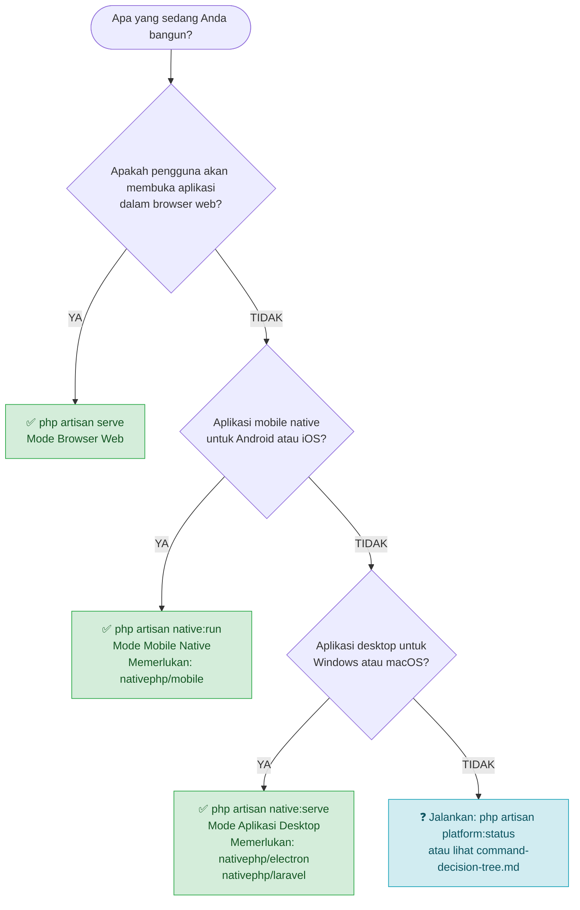

# Panduan Penggunaan Perintah

Panduan ini membantu Anda memilih perintah Artisan yang tepat untuk platform target Anda, menjelaskan apa yang dibutuhkan setiap perintah agar dapat berfungsi, dan menyediakan referensi pemecahan masalah untuk masalah paling umum yang akan Anda temui.

---

## Pohon Keputusan Cepat

Gunakan diagram alur di bawah ini untuk memilih perintah yang tepat. Untuk dokumen pohon keputusan mandiri dengan diagram Mermaid lengkap dan referensi cepat pemecahan masalah, lihat [command-decision-tree.md](./command-decision-tree.md).



Masih bingung? Tanyakan pada diri sendiri:

1. **Apakah pengguna akan membuka aplikasi di browser (Chrome, Safari, Firefox)?**
   → `php artisan serve`

2. **Apakah aplikasi akan diinstal di ponsel Android atau iPhone / iPad?**
   → `php artisan native:run`

3. **Apakah aplikasi akan dikirimkan sebagai program desktop `.exe` (Windows) atau `.app` (macOS)?**
   → `php artisan native:serve`

---

## Referensi Perintah

### `php artisan serve` — Mode Browser Web

Memulai server HTTP pengembangan Laravel standar di `http://localhost:8000`.

```bash
php artisan serve

# Ganti port
php artisan serve --port=8080

# Dengarkan di semua antarmuka (berguna untuk akses LAN)
php artisan serve --host=0.0.0.0 --port=8000
```

**Mode platform yang diinisialisasi:** `PlatformMode::Web`

**Kasus RuntimePlatform yang terdeteksi pada waktu request:**

| User Agent | Kasus RuntimePlatform |
|------------|---------------------|
| Browser Windows / Linux | `WebsiteWindows` |
| Browser macOS | `WebsiteMacOS` |
| Browser Android | `WebsiteAndroid` |
| Browser iPhone / iPad | `WebsiteIos` |

**Yang dikonfigurasi secara otomatis:**

- Lingkungan: menggabungkan `.env.web` (jika ada) di atas `.env`
- Aset: membaca `public/build/web/manifest.json`
- Driver sesi: `cookie` (ketika `.env.web` memiliki `SESSION_DRIVER=cookie`)
- Kamera: WebRTC `getUserMedia` API

**Prasyarat:**

- PHP 8.2+ CLI
- Dependensi Composer terinstal (`composer install`)
- Aset web dikompilasi (`npm run build:web`) — atau server dev Vite berjalan (`npm run dev:web`)
- File `.env` ada di root proyek
- Opsional: `.env.web` untuk override khusus web

Tidak diperlukan paket Composer tambahan di luar instalasi Laravel standar.

---

### `php artisan native:run` — Mode Mobile Native (Android / iOS)

Membangun, mengemas, dan men-deploy aplikasi ke perangkat/emulator Android atau perangkat/simulator iOS. Server HTTP Laravel berjalan tertanam di dalam proses aplikasi native.

```bash
# Deteksi otomatis platform (Android di Windows/Linux, prompt di macOS)
php artisan native:run

# Target Android secara eksplisit (lebih memilih perangkat fisik yang terhubung)
php artisan native:run android

# Target iOS secara eksplisit (hanya macOS)
php artisan native:run ios

# Target perangkat tertentu berdasarkan serial ADB
php artisan native:run android <udid>

# Aktifkan hot reloading selama pengembangan
php artisan native:run --watch

# Release build
php artisan native:run android --build=release

# Android App Bundle (untuk Play Store)
php artisan native:run android --build=bundle
```

**Mode platform yang diinisialisasi:** `PlatformMode::Mobile`

**Kasus RuntimePlatform yang dihasilkan:**

- `MobileAppAndroid` — perangkat atau emulator Android
- `MobileAppIos` — iPhone atau iPad

**Yang dikonfigurasi secara otomatis:**

- Lingkungan: menggabungkan `.env.mobile` (jika ada) di atas `.env`
- Aset: membaca `public/build/mobile/manifest.json`
- Driver sesi: `database` (direkomendasikan untuk mobile — bertahan saat aplikasi di-restart)
- Kamera: NativePHP Mobile Camera API (bukan WebRTC)
- Rute: memuat `routes/mobile.php` selain rute standar

**Prasyarat:**

| Persyaratan | Detail |
|-------------|---------| 
| Paket Composer `nativephp/mobile` | `composer require nativephp/mobile` |
| `NATIVEPHP_APP_ID` di `.env` | mis. `com.example.weddingorganizer` — tidak boleh default |
| Android SDK + ADB | Diperlukan untuk target Android; tambahkan ke `PATH` |
| Xcode + `devicectl` | Diperlukan untuk target iOS; hanya macOS |
| Aset mobile dikompilasi | `npm run build:mobile` (atau `npm run dev:mobile` untuk HMR) |
| Opsional: `.env.mobile` | Override `APP_URL`, `SESSION_DRIVER`, port, dll. |

Jalankan `php artisan platform:native:run` (wrapper validasi) untuk mendapatkan daftar error yang mudah dibaca tentang paket yang hilang sebelum perintah sesungguhnya dijalankan.

---

### `php artisan native:serve` — Mode Aplikasi Desktop (Windows / macOS)

Memulai aplikasi desktop NativePHP Electron. Electron membungkus server HTTP PHP tertanam dan membuka jendela aplikasi yang mengarah ke backend Laravel.

```bash
# Mulai aplikasi desktop
php artisan native:serve

# Lewati queue worker
php artisan native:serve --without-queue

# Lewati scheduler
php artisan native:serve --without-schedule

# Sembunyikan output log Laravel dari konsol
php artisan native:serve --quiet-logs
```

**Mode platform yang diinisialisasi:** `PlatformMode::Desktop`

**Kasus RuntimePlatform yang dihasilkan:**

- `DesktopAppWindows` — PC Windows
- `DesktopAppMacOS` — macOS

**Yang dikonfigurasi secara otomatis:**

- Lingkungan: menggabungkan `.env.desktop` (jika ada) di atas `.env`
- Aset: membaca `public/build/desktop/manifest.json`
- Driver sesi: `file` (proses lokal pengguna tunggal)
- Kamera: NativePHP Electron Camera API (bukan WebRTC)
- Rute: memuat `routes/desktop.php` selain rute standar

**Prasyarat:**

| Persyaratan | Detail |
|-------------|---------| 
| Paket Composer `nativephp/electron` | `composer require nativephp/electron` |
| Paket Composer `nativephp/laravel` | `composer require nativephp/laravel` |
| Node.js + toolchain Electron | Diinstal secara otomatis oleh `nativephp/electron` |
| Aset desktop dikompilasi | `npm run build:desktop` (atau `npm run dev:desktop` untuk HMR) |
| Opsional: `.env.desktop` | Override `APP_URL`, `NATIVEPHP_HTTP_PORT`, driver sesi, dll. |

Jalankan `php artisan platform:native:serve` (wrapper validasi) untuk mendapatkan daftar error yang mudah dibaca tentang paket yang hilang sebelum perintah sesungguhnya dijalankan.

---

## Perbandingan Berdampingan

| | `artisan serve` | `artisan native:run` | `artisan native:serve` |
|---|---|---|---|
| Target | Browser web | Android / iOS | Desktop Windows / macOS |
| PlatformMode | `Web` | `Mobile` | `Desktop` |
| RuntimePlatform | WebsiteWindows/MacOS/Android/Ios | MobileAppAndroid/Ios | DesktopAppWindows/MacOS |
| File override env | `.env.web` | `.env.mobile` | `.env.desktop` |
| Direktori aset | `public/build/web` | `public/build/mobile` | `public/build/desktop` |
| API Kamera | WebRTC getUserMedia | NativePHP Mobile Camera | NativePHP Electron Camera |
| Port default | 8000 | 8001 | 8002 |
| Paket tambahan yang diperlukan | Tidak ada | `nativephp/mobile` | `nativephp/electron`, `nativephp/laravel` |
| Rute khusus platform | `routes/web.php` | `routes/mobile.php` | `routes/desktop.php` |

---

## Alur Kerja Pengembangan yang Direkomendasikan

Selama pengembangan Anda dapat menjalankan ketiga platform secara bersamaan dengan membuka tiga jendela terminal, satu per platform. Masing-masing menggunakan port berbeda sehingga tidak saling konflik.

### Terminal 1 — Web (port 8000)

```bash
# Mulai server dev Vite dengan HMR untuk web
npm run dev:web

# Di tab terpisah: mulai server HTTP Laravel
php artisan serve --port=8000
```

### Terminal 2 — Mobile (port 8001)

```bash
# Mulai server dev Vite dengan HMR untuk mobile
npm run dev:mobile

# Build dan deploy ke perangkat Android yang terhubung (dengan hot reload)
php artisan native:run android --watch
```

### Terminal 3 — Desktop (port 8002)

```bash
# Mulai server dev Vite dengan HMR untuk desktop
npm run dev:desktop

# Mulai aplikasi desktop Electron
php artisan native:serve
```

### Konvensi Penugasan Port

| Platform | Port Laravel | Port Vite HMR |
|----------|-------------|--------------|
| Web | 8000 | 5173 |
| Mobile | 8001 | 5174 |
| Desktop | 8002 | 5175 |

Port diatur di `.env.web`, `.env.mobile`, dan `.env.desktop`. Override port Vite melalui `VITE_PORT` sebelum perintah npm:

```bash
VITE_PORT=5200 npm run dev:web
```

### Periksa Apa yang Sedang Aktif

Kapan saja Anda dapat memeriksa mode platform aktif dan kumpulan fitur:

```bash
php artisan platform:status
```

Ini menampilkan mode yang terdeteksi, runtime platform, file lingkungan yang dimuat, direktori aset aktif, dan fitur yang tersedia.

### Beralih Mode Selama Pengembangan

Saat beralih antara platform, bersihkan rute yang di-cache dan status deteksi platform agar data lama tidak terbawa:

```bash
php artisan platform:clear
```

Ini memflush rute yang di-cache dan singleton deteksi platform mana pun.

---

## Referensi Perintah Build

Kompilasi aset untuk platform sebelum melayani di produksi, atau saat memulai sesi pengembangan baru tanpa HMR:

```bash
# Build hanya bundel web
npm run build:web

# Build hanya bundel mobile
npm run build:mobile

# Build hanya bundel desktop
npm run build:desktop

# Build ketiganya secara berurutan
npm run build:all
```

Direktori output:

```
public/
  build/
    web/        ← digunakan oleh php artisan serve
    mobile/     ← digunakan oleh php artisan native:run
    desktop/    ← digunakan oleh php artisan native:serve
```

---

## Pemecahan Masalah

### 1. Dependensi NativePHP yang Hilang

**Gejala:**

```
Error: Required dependencies for Mobile Native mode are not installed.

Missing packages:
  - nativephp/mobile

To install, run:
  composer require nativephp/mobile
```

Atau untuk mode Desktop:

```
Error: Required dependencies for Desktop Application mode are not installed.

Missing packages:
  - nativephp/electron
  - nativephp/laravel

To install, run:
  composer require nativephp/electron nativephp/laravel
```

**Penyebab:** Anda menjalankan `native:run` atau `native:serve` sebelum menginstal paket Composer yang diperlukan.

**Solusi:**

```bash
# Untuk mode Mobile
composer require nativephp/mobile

# Untuk mode Desktop
composer require nativephp/electron nativephp/laravel
```

Setelah menginstal, jalankan `php artisan native:install` untuk menyiapkan struktur proyek NativePHP, lalu coba perintah Anda lagi.

Gunakan wrapper validasi untuk mendapatkan error ini lebih awal dengan instruksi yang jelas:

```bash
php artisan platform:native:run     # wrapper validasi untuk native:run
php artisan platform:native:serve   # wrapper validasi untuk native:serve
```

---

### 2. Port Salah — Alamat Sudah Digunakan

**Gejala:**

```
Failed to listen on 127.0.0.1:8000 (reason: Address already in use)
```

Atau dalam aplikasi NativePHP, server tertanam diam-diam gagal dimulai dan aplikasi menampilkan halaman kosong.

**Penyebab:** Proses lain sudah terikat ke port — sering instance `php artisan serve` lain atau sesi NativePHP sebelumnya.

**Solusi:**

```bash
# Cari apa yang menggunakan port (Windows)
netstat -ano | findstr :8000

# Cari apa yang menggunakan port (macOS / Linux)
lsof -i :8000

# Hentikan proses yang konflik (Windows, PID dari atas)
taskkill /PID <pid> /F

# Hentikan proses yang konflik (macOS / Linux)
kill -9 <pid>
```

Alternatifnya, tentukan port yang berbeda:

```bash
php artisan serve --port=8080
```

Untuk mode NativePHP, ubah `APP_PORT` dan `NATIVEPHP_HTTP_PORT` (Desktop) atau `NATIVE_SERVER_PORT` (Mobile) di file `.env.*` yang relevan.

---

### 3. File Lingkungan Tidak Ditemukan

**Gejala:** Pengaturan khusus platform (driver sesi, `APP_URL`, port) tidak diterapkan meskipun Anda telah membuat file `.env.mobile` atau `.env.desktop`.

Atau dalam log:

```
[debug] Platform environment file not found, using base environment  {"file":".env.mobile","mode":"mobile"}
```

**Penyebab:** File env platform tidak ada di root proyek, atau memiliki nama yang salah. Kesalahan umum:

- File ditempatkan di subdirektori alih-alih root proyek.
- Typo dalam nama file (`.env.Mobile` vs `.env.mobile`).
- Hanya file `.example` yang disalin tetapi tidak diubah namanya.

**Solusi:**

```bash
# Salin file contoh (jalankan dari root proyek)
cp .env.web.example .env.web
cp .env.mobile.example .env.mobile
cp .env.desktop.example .env.desktop
```

Verifikasi lokasi: keempat file (`.env`, `.env.web`, `.env.mobile`, `.env.desktop`) harus berada di level yang sama dengan `composer.json`.

Periksa log debug `EnvironmentManager` di `storage/logs/laravel.log` untuk mengkonfirmasi file mana yang dicari dan apakah ditemukan.

---

### 4. Aset Tidak Dikompilasi — 404 pada JS/CSS atau Halaman Kosong

**Gejala:**

```
GET /build/mobile/assets/app-mobile.abc12345.js  404 Not Found
```

Atau halaman dimuat tetapi tanpa gaya, tanpa interaktivitas, atau error manifest Vite di konsol browser.

**Penyebab:** Bundel aset untuk mode platform aktif belum dikompilasi, atau dikompilasi untuk platform yang berbeda.

**Solusi:**

```bash
# Kompilasi aset untuk platform yang Anda layani
npm run build:web      # untuk php artisan serve
npm run build:mobile   # untuk php artisan native:run
npm run build:desktop  # untuk php artisan native:serve
```

Untuk pengembangan dengan live reloading, jalankan server dev yang sesuai sebagai gantinya:

```bash
npm run dev:web        # port 5173
npm run dev:mobile     # port 5174
npm run dev:desktop    # port 5175
```

Untuk mengkonfirmasi jalur manifest mana yang dibaca aplikasi:

```bash
php artisan platform:status
```

Output menampilkan `Asset directory: public/build/<platform>` dan apakah `manifest.json` ada di jalur tersebut.

---

### 5. Deteksi Platform Defaulting ke Web (Unexpected `WebsiteWindows`)

**Gejala:** Aplikasi berperilaku seolah berjalan dalam mode Web meskipun Anda memulainya dengan `native:run` atau `native:serve`. Fitur seperti akses kamera native tidak tersedia, dan `php artisan platform:status` melaporkan `PlatformMode: Web`.

**Penyebab:** `PlatformCommandDetector` membaca `$_SERVER['argv']` untuk mengidentifikasi perintah Artisan. Jika nama perintah di `argv[1]` tidak cocok persis dengan `serve`, `native:run`, atau `native:serve`, deteksi jatuh kembali ke mode Web. Ini dapat terjadi ketika:

- Perintah tidak dijalankan melalui Artisan CLI (mis. diluncurkan langsung sebagai proses HTTP).
- Skrip wrapper mengubah `argv[0]` sehingga `artisan` tidak terdeteksi.
- Variabel lingkungan `NATIVEPHP_RUNNING`, `ELECTRON_RUN_AS_NODE`, atau `NATIVE_MOBILE_RUNNING` tidak diatur saat berjalan di dalam runtime native.

**Solusi:**

1. Periksa `storage/logs/laravel.log` untuk entri warning `Platform detection failed` — berisi exception yang mendasarinya.

2. Untuk fallback server HTTP / tertanam, pastikan runtime native menetapkan variabel lingkungan yang benar:

   ```dotenv
   # Di .env.desktop — diatur secara otomatis oleh NativePHP Electron
   NATIVEPHP_RUNNING=true

   # Di .env.mobile — diatur secara otomatis oleh NativePHP Mobile
   NATIVE_MOBILE_RUNNING=true
   ```

3. Jalankan ulang perintah langsung dari terminal alih-alih melalui launcher atau konfigurasi run IDE, yang mungkin menghapus atau mengubah `argv`.

4. Jalankan `php artisan platform:clear` lalu coba lagi. File rute yang di-cache dari sesi mode Web sebelumnya dapat menyebabkan aplikasi berperilaku seolah modenya Web bahkan setelah perintah berubah.

---

## Lihat Juga

- [Pohon Keputusan Penggunaan Perintah](./command-decision-tree.md) — diagram alur untuk memilih perintah yang tepat dengan referensi cepat pemecahan masalah
- [Arsitektur Dukungan Platform](./platform-support.md) — ikhtisar komponen dan alur data
- [Strategi Konfigurasi Lingkungan](./environment-configuration.md) — struktur file `.env.*` dan aturan penggabungan
- [Proses Kompilasi Aset](./asset-compilation.md) — pipeline build Vite dan pengaturan HMR
- [Matriks Fitur Platform](./platform-features.md) — ketersediaan fitur per platform
- `php artisan platform:status` — periksa mode aktif, runtime platform, dan fitur
- `php artisan platform:clear` — flush rute yang di-cache dan status platform
