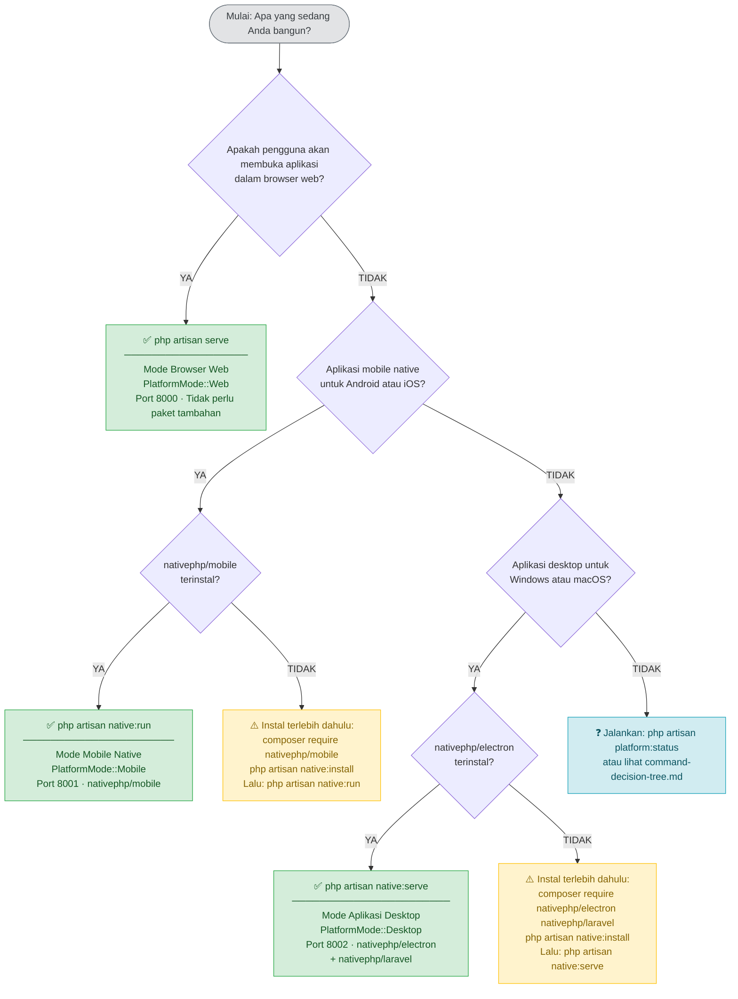

# Arsitektur Dukungan Platform

Dokumen ini membahas bagaimana aplikasi Laravel Wedding Organizer CBIR menangani tiga lingkungan runtime yang berbeda: browser web, aplikasi mobile native, dan aplikasi desktop native. Setiap lingkungan dimulai dengan perintah Artisan tertentu dan mendapatkan konfigurasi lingkungan, bundel aset, dan kumpulan fiturnya sendiri.

---

## Mode Platform

Aplikasi mendukung tiga mode platform, masing-masing dipicu oleh perintah Artisan khusus.

### Mode Server Web

```bash
php artisan serve
```

Menyajikan aplikasi untuk browser web melalui HTTP. Menggunakan penanganan sesi/cookie Laravel standar dan WebRTC untuk akses kamera. Ideal untuk pengembangan dan deployment khusus web.

**Kasus RuntimePlatform yang dihasilkan:**
- `WebsiteWindows` — browser desktop Windows/Linux
- `WebsiteMacOS` — Safari/Chrome/Firefox macOS
- `WebsiteAndroid` — Chrome/Firefox di Android
- `WebsiteIos` — Safari di iPhone/iPad

### Mode Mobile Native

```bash
php artisan native:run
```

Memulai aplikasi yang tertanam di dalam wrapper NativePHP Mobile yang menargetkan Android dan iOS. Server HTTP Laravel berjalan secara lokal di dalam proses aplikasi. Memerlukan paket mobile `laravel-native`.

**Kasus RuntimePlatform yang dihasilkan:**
- `MobileAppAndroid`
- `MobileAppIos`

### Mode Aplikasi Desktop

```bash
php artisan native:serve
```

Memulai aplikasi di dalam jendela Electron (NativePHP Desktop) di Windows atau macOS. Server PHP berjalan sebagai proses latar belakang di dalam aplikasi Electron. Memerlukan paket `nativephp/electron`.

**Kasus RuntimePlatform yang dihasilkan:**
- `DesktopAppWindows`
- `DesktopAppMacOS`

---

## Enum RuntimePlatform

`App\Enums\RuntimePlatform` mewakili delapan kasus runtime spesifik di mana aplikasi dapat beroperasi. Ia berada satu level di bawah `PlatformMode` — mode memberi tahu Anda *perintah mana yang memulai aplikasi*, sementara `RuntimePlatform` memberi tahu Anda *perangkat/OS apa yang sebenarnya menjalankannya*.

```php
enum RuntimePlatform: string
{
    // Mode Web → 4 kasus website
    case WebsiteWindows  = 'website_windows';
    case WebsiteMacOS    = 'website_macos';
    case WebsiteAndroid  = 'website_android';
    case WebsiteIos      = 'website_ios';

    // Mode Mobile → 2 kasus aplikasi mobile
    case MobileAppAndroid = 'mobile_app_android';
    case MobileAppIos     = 'mobile_app_ios';

    // Mode Desktop → 2 kasus aplikasi desktop
    case DesktopAppWindows = 'desktop_app_windows';
    case DesktopAppMacOS   = 'desktop_app_macos';
}
```

### Hubungan dengan PlatformMode

| PlatformMode | Kasus RuntimePlatform |
|---|---|
| `Web` | `WebsiteWindows`, `WebsiteMacOS`, `WebsiteAndroid`, `WebsiteIos` |
| `Mobile` | `MobileAppAndroid`, `MobileAppIos` |
| `Desktop` | `DesktopAppWindows`, `DesktopAppMacOS` |

### Metode helper kategori

Enum mengekspos tiga metode kategori yang saling eksklusif. Tepat satu yang mengembalikan `true` untuk kasus mana pun:

```php
$platform->isWebsite();    // true untuk semua kasus Website*
$platform->isMobileApp();  // true untuk kasus MobileApp*
$platform->isDesktopApp(); // true untuk kasus DesktopApp*
```

### Metode helper fitur

```php
$platform->hasNativeCameraAccess();  // MobileApp* + DesktopApp*
$platform->hasWebRTCAccess();        // hanya Website*
$platform->hasFileSystemAccess();    // MobileApp* + DesktopApp*
$platform->hasDesktopNotifications();// hanya DesktopApp*
$platform->hasPushNotifications();   // hanya MobileApp*
$platform->hasAutoUpdates();         // hanya DesktopApp*
$platform->hasAppBadge();            // hanya MobileApp*

// Mendelegasikan ke PlatformFeatureRegistry:
$platform->hasFeature('camera');
$platform->getAvailableFeatures();   // mengembalikan string[]
```

### Mode kamera CBIR

```php
$platform->cbirCameraMode(); // 'native' (mobile/desktop) atau 'webrtc' (website)
```

Gunakan ini untuk memutuskan API kamera mana yang akan dipanggil untuk fitur pencarian CBIR.

---

## Ikhtisar Komponen

### PlatformCommandDetector

**Lokasi:** `app/Support/Platform/PlatformCommandDetector.php`

Membaca `$_SERVER['argv']` selama bootstrap aplikasi untuk mengidentifikasi perintah Artisan mana yang dieksekusi, kemudian memetakannya ke nilai `PlatformMode`.

| Perintah | Mode yang Terdeteksi |
|---|---|
| `artisan serve` | `PlatformMode::Web` |
| `artisan native:run` | `PlatformMode::Mobile` |
| `artisan native:serve` | `PlatformMode::Desktop` |
| `artisan native:*` lainnya | `PlatformMode::Desktop` |
| Tanpa artisan / request HTTP | Fallback ke deteksi runtime |

Ketika tidak berjalan melalui Artisan (mis. request HTTP tertanam), ia jatuh kembali ke pemeriksaan variabel env:
- `NATIVEPHP_RUNNING` atau `ELECTRON_RUN_AS_NODE` → Desktop
- `NATIVE_MOBILE_RUNNING` → Mobile
- Selain itu → Web

```php
// Titik masuk publik tunggal
$mode = PlatformCommandDetector::detectMode(); // PlatformMode
```

---

### RuntimePlatformDetector

**Lokasi:** `app/Support/Platform/RuntimePlatformDetector.php`

Diberikan `PlatformMode` dan `Request` HTTP opsional, mempersempit mode ke kasus `RuntimePlatform` yang tepat.

- **Mode Web** — mengurai header `User-Agent` untuk `iphone/ipad/ipod` (→ iOS), `android` (→ Android), `mac/darwin` (→ macOS), default (→ Windows).
- **Mode Mobile** — mengquery `\Native\Mobile\Device::platform()` jika tersedia; jatuh kembali ke `config('native.platform', 'android')`.
- **Mode Desktop** — memeriksa `PHP_OS_FAMILY`; `Darwin` → macOS, lainnya → Windows.

Saat terjadi exception, detektor mencatat warning dan mengembalikan `RuntimePlatform::WebsiteWindows`.

```php
$detector = app(RuntimePlatformDetector::class);
$runtime  = $detector->detect($mode, $request); // RuntimePlatform
```

---

### EnvironmentManager

**Lokasi:** `app/Support/Platform/EnvironmentManager.php`

Memuat dan menggabungkan file `.env.{mode}` khusus platform di atas `.env` dasar yang sudah dimuat. Nilai khusus platform mendapat prioritas.

| Mode Platform | File yang dimuat |
|---|---|
| Web | `.env.web` |
| Mobile | `.env.mobile` |
| Desktop | `.env.desktop` |

Jika file tidak ada, manager mencatat pesan debug dan melanjutkan tanpa error.

```php
$envManager = app(EnvironmentManager::class);
$envManager->loadPlatformEnvironment($mode);

// Periksa apakah file env platform ada
$envManager->platformEnvironmentExists($mode); // bool
```

Contoh `.env.mobile`:

```env
APP_URL=http://10.0.2.2:8000
VITE_PLATFORM=mobile
SESSION_DRIVER=database
```

---

### PlatformAssetManager

**Lokasi:** `app/Support/Platform/PlatformAssetManager.php`

Me-resolve jalur output build Vite dan entri manifest khusus platform.

| Mode Platform | Direktori build | Titik masuk Vite |
|---|---|---|
| Web | `public/build/web` | `resources/js/app-web/app-web.js` |
| Mobile | `public/build/mobile` | `resources/js/app-mobile/app-mobile.js` |
| Desktop | `public/build/desktop` | `resources/js/app-desktop/app-desktop.js` |

```php
$assetManager = app(PlatformAssetManager::class);
$assetManager->configure($mode);

$assetManager->getBuildDirectory();  // mis. "build/web"
$assetManager->getManifestPath();    // path absolut ke manifest.json
$assetManager->getViteInput();       // mis. "resources/js/app-web/app-web.js"
$assetManager->asset('resources/js/app-web/app-web.js'); // URL berversi
$assetManager->manifestExists();     // bool
```

---

### PlatformFeatureRegistry

**Lokasi:** `app/Support/Platform/PlatformFeatureRegistry.php`

Mempertahankan matriks fitur statis yang memetakan nama fitur ke kasus `RuntimePlatform` yang mendukungnya.

```php
$registry = app(PlatformFeatureRegistry::class);

// Periksa satu fitur
$registry->isAvailable('camera', RuntimePlatform::MobileAppAndroid); // true
$registry->isAvailable('webrtc', RuntimePlatform::DesktopAppWindows); // false

// Dapatkan semua fitur untuk satu platform
$registry->getAvailableFeatures(RuntimePlatform::DesktopAppMacOS);
// ['camera', 'desktop_notifications', 'file_system', 'auto_updates']

// Dapatkan semua platform untuk satu fitur
$registry->getPlatformsForFeature('push_notifications');
// [RuntimePlatform::MobileAppAndroid, RuntimePlatform::MobileAppIos]
```

Matriks ketersediaan fitur:

| Fitur | WebsiteWindows | WebsiteMacOS | WebsiteAndroid | WebsiteIos | MobileAppAndroid | MobileAppIos | DesktopAppWindows | DesktopAppMacOS |
|---|:---:|:---:|:---:|:---:|:---:|:---:|:---:|:---:|
| `camera` | ❌ | ❌ | ❌ | ❌ | ✅ | ✅ | ✅ | ✅ |
| `webrtc` | ✅ | ✅ | ✅ | ✅ | ❌ | ❌ | ❌ | ❌ |
| `file_system` | ❌ | ❌ | ❌ | ❌ | ✅ | ✅ | ✅ | ✅ |
| `desktop_notifications` | ❌ | ❌ | ❌ | ❌ | ❌ | ❌ | ✅ | ✅ |
| `push_notifications` | ❌ | ❌ | ❌ | ❌ | ✅ | ✅ | ❌ | ❌ |
| `auto_updates` | ❌ | ❌ | ❌ | ❌ | ❌ | ❌ | ✅ | ✅ |
| `app_badge` | ❌ | ❌ | ❌ | ❌ | ✅ | ✅ | ❌ | ❌ |

---

### PlatformModeServiceProvider

**Lokasi:** `app/Providers/PlatformModeServiceProvider.php`

Perekat yang menghubungkan semuanya selama bootstrap aplikasi. Harus didaftarkan **sebelum** `RouteServiceProvider` agar singleton `platform.mode` tersedia saat rute kondisional dimuat.

**Fase `register()`** (sebelum boot):
- Memanggil `PlatformCommandDetector::detectMode()` dan mengikat hasilnya sebagai `app('platform.mode')`
- Mendaftarkan `RuntimePlatformDetector`, `EnvironmentManager`, dan `PlatformAssetManager` sebagai singleton

**Fase `boot()`** (setelah semua provider terdaftar):
1. Me-resolve `platform.mode`
2. Memanggil `EnvironmentManager::loadPlatformEnvironment($mode)` — menggabungkan `.env.{mode}`
3. Mengikat `app('runtime.platform')` dengan memanggil `RuntimePlatformDetector::detect($mode, $request)`
4. Memanggil `PlatformAssetManager::configure($mode)` — menetapkan direktori build
5. Di lingkungan `local`, mencatat semua detail deteksi ke log Laravel

---

## Alur Data

Dari eksekusi perintah ke aplikasi yang sepenuhnya dikonfigurasi:

```
1. Developer menjalankan: php artisan native:run
       │
       ▼
2. PlatformCommandDetector membaca argv[1] = "native:run"
   → mengembalikan PlatformMode::Mobile
       │
       ▼
3. PlatformModeServiceProvider::register()
   → mengikat app('platform.mode') = PlatformMode::Mobile
       │
       ▼
4. PlatformModeServiceProvider::boot()
   → EnvironmentManager memuat .env.mobile
     (menggabungkan SESSION_DRIVER=database, APP_URL=..., dll.)
       │
       ▼
5. RuntimePlatformDetector::detect(PlatformMode::Mobile, null)
   → mengquery Native\Mobile\Device::platform()
   → mengembalikan RuntimePlatform::MobileAppAndroid (atau MobileAppIos)
   → mengikat app('runtime.platform')
       │
       ▼
6. PlatformAssetManager::configure(PlatformMode::Mobile)
   → menetapkan direktori build ke "build/mobile"
   → manifest path = public/build/mobile/manifest.json
       │
       ▼
7. RouteServiceProvider memuat routes/mobile.php (rute khusus mobile)
       │
       ▼
8. Tampilan meminta aset melalui PlatformAssetManager::asset(...)
   → mengembalikan URL berversi dari build/mobile/manifest.json
```

Dalam diagram urutan:

```
artisan native:run
      │
      │ deteksi argv
      ▼
PlatformCommandDetector ──── PlatformMode::Mobile ────► PlatformModeServiceProvider
                                                               │
                               ┌───────────────────────────────┤
                               │                               │
                               ▼                               ▼
                       EnvironmentManager              RuntimePlatformDetector
                       (memuat .env.mobile)            (mengembalikan MobileAppAndroid)
                               │                               │
                               └───────────────────────────────┤
                                                               │
                                                               ▼
                                                       PlatformAssetManager
                                                       (build/mobile)
                                                               │
                                                               ▼
                                                     Aplikasi sepenuhnya dikonfigurasi
```

---

## Matriks Fitur Platform

Tabel di bawah ini menampilkan setiap fitur bernama yang dilacak oleh `PlatformFeatureRegistry` dan kasus `RuntimePlatform` mana dari delapan yang mendukungnya.

> **Keterangan:** ✅ Tersedia &nbsp;|&nbsp; ❌ Tidak tersedia

| Fitur | Web Win | Web macOS | Web Android | Web iOS | Mobile Android | Mobile iOS | Desktop Win | Desktop macOS |
|---|:---:|:---:|:---:|:---:|:---:|:---:|:---:|:---:|
| `camera` | ❌ | ❌ | ❌ | ❌ | ✅ | ✅ | ✅ | ✅ |
| `webrtc` | ✅ | ✅ | ✅ | ✅ | ❌ | ❌ | ❌ | ❌ |
| `file_system` | ❌ | ❌ | ❌ | ❌ | ✅ | ✅ | ✅ | ✅ |
| `desktop_notifications` | ❌ | ❌ | ❌ | ❌ | ❌ | ❌ | ✅ | ✅ |
| `push_notifications` | ❌ | ❌ | ❌ | ❌ | ✅ | ✅ | ❌ | ❌ |
| `auto_updates` | ❌ | ❌ | ❌ | ❌ | ❌ | ❌ | ✅ | ✅ |
| `app_badge` | ❌ | ❌ | ❌ | ❌ | ✅ | ✅ | ❌ | ❌ |

Header kolom dipetakan ke kasus enum `RuntimePlatform`:

| Label singkat | Kasus `RuntimePlatform` |
|---|---|
| Web Win | `WebsiteWindows` |
| Web macOS | `WebsiteMacOS` |
| Web Android | `WebsiteAndroid` |
| Web iOS | `WebsiteIos` |
| Mobile Android | `MobileAppAndroid` |
| Mobile iOS | `MobileAppIos` |
| Desktop Win | `DesktopAppWindows` |
| Desktop macOS | `DesktopAppMacOS` |

### Deskripsi fitur

| Fitur | Deskripsi |
|---|---|
| `camera` | Akses kamera perangkat native melalui NativePHP APIs (lembar mobile / dialog desktop) |
| `webrtc` | Akses kamera berbasis browser melalui `MediaDevices.getUserMedia()` |
| `file_system` | Akses baca/tulis ke sistem file lokal melalui NativePHP |
| `desktop_notifications` | Toast notifikasi desktop tingkat OS (NativePHP Electron) |
| `push_notifications` | Push notification jarak jauh yang dikirimkan ke aplikasi mobile |
| `auto_updates` | Mekanisme pembaruan otomatis dalam aplikasi yang disediakan oleh NativePHP Electron |
| `app_badge` | Penghitung badge layar beranda / dock pada mobile |

### Dikelompokkan berdasarkan kategori platform

| Fitur | Platform Website | Aplikasi Mobile | Aplikasi Desktop |
|---|:---:|:---:|:---:|
| `camera` | ❌ | ✅ | ✅ |
| `webrtc` | ✅ | ❌ | ❌ |
| `file_system` | ❌ | ✅ | ✅ |
| `desktop_notifications` | ❌ | ❌ | ✅ |
| `push_notifications` | ❌ | ✅ | ❌ |
| `auto_updates` | ❌ | ❌ | ✅ |
| `app_badge` | ❌ | ✅ | ❌ |

---

## Memeriksa Ketersediaan Fitur dalam Kode

Ada tiga pendekatan yang setara untuk mengquery ketersediaan fitur, bergantung pada konteks.

### 1. Helper global `platform_feature()` (direkomendasikan untuk tampilan dan kontroler)

`platform_feature(string $feature): bool` memeriksa fitur terhadap singleton `RuntimePlatform` **saat ini** yang di-resolve dari kontainer layanan.

```php
// Guard boolean sederhana
if (platform_feature('camera')) {
    // Hanya dicapai di platform MobileApp* dan DesktopApp*
    $image = CameraService::capture();
}

if (platform_feature('webrtc')) {
    // Hanya dicapai di platform Website*
}

if (platform_feature('file_system')) {
    // Hanya dicapai di platform MobileApp* dan DesktopApp*
    Storage::disk('local')->put('export.csv', $csv);
}

if (platform_feature('desktop_notifications')) {
    \Native\Laravel\Notification::title('Pesanan diperbarui')
        ->message('Status pesanan Anda telah berubah.')
        ->send();
}

if (platform_feature('push_notifications')) {
    // Trigger push FCM/APNs melalui layanan notifikasi mobile Anda
    $user->notify(new OrderStatusNotification($order));
}

if (platform_feature('auto_updates')) {
    // Tampilkan item menu "Periksa pembaruan" di aplikasi desktop
}

if (platform_feature('app_badge')) {
    // Atur jumlah badge pesan yang belum dibaca
}
```

### 2. Metode enum `RuntimePlatform` (eksplisit, type-safe)

Jika Anda sudah memiliki instance `RuntimePlatform`, Anda dapat memanggil metode per fitur secara langsung:

```php
$platform = runtime_platform();  // atau app('runtime.platform')

$platform->hasNativeCameraAccess();   // fitur camera
$platform->hasWebRTCAccess();         // fitur webrtc
$platform->hasFileSystemAccess();     // fitur file_system
$platform->hasDesktopNotifications(); // fitur desktop_notifications
$platform->hasPushNotifications();    // fitur push_notifications
$platform->hasAutoUpdates();          // fitur auto_updates
$platform->hasAppBadge();             // fitur app_badge

// Atau delegasikan ke registry melalui hasFeature():
$platform->hasFeature('camera');
$platform->hasFeature('webrtc');
```

### 3. `PlatformFeatureRegistry` secara langsung (berguna di service dan pengujian)

```php
use App\Support\Platform\PlatformFeatureRegistry;
use App\Enums\RuntimePlatform;

$registry = app(PlatformFeatureRegistry::class);

// Periksa satu fitur terhadap satu platform
$registry->isAvailable('camera', RuntimePlatform::MobileAppAndroid); // true
$registry->isAvailable('webrtc', RuntimePlatform::DesktopAppWindows); // false

// Dapatkan semua fitur yang didukung oleh platform tertentu
$features = $registry->getAvailableFeatures(RuntimePlatform::DesktopAppMacOS);
// ['camera', 'desktop_notifications', 'file_system', 'auto_updates']

// Dapatkan semua platform yang mendukung suatu fitur
$platforms = $registry->getPlatformsForFeature('push_notifications');
// [RuntimePlatform::MobileAppAndroid, RuntimePlatform::MobileAppIos]
```

### Menggabungkan pemeriksaan fitur dengan helper mode

Ketika Anda ingin memilah secara luas berdasarkan kategori platform lalu menyempurnakan dengan fitur tertentu:

```php
// Pemeriksaan mode luas
if (is_mobile_mode()) {
    // Setup khusus mobile — push notification, kamera, badge
    if (platform_feature('camera')) {
        // ... daftarkan binding rute kamera native
    }
} elseif (is_desktop_mode()) {
    // Setup khusus desktop — notifikasi desktop, pembaruan otomatis
    if (platform_feature('desktop_notifications')) {
        // ... daftarkan listener notifikasi OS
    }
} else {
    // Fallback web — WebRTC, penanganan sesi browser
    if (platform_feature('webrtc')) {
        // ... mount komponen kamera browser
    }
}
```

### Pemeriksaan fitur dalam template Blade

```blade
@if(platform_feature('camera'))
    <x-native-camera-button />
@elseif(platform_feature('webrtc'))
    <x-webrtc-camera-button />
@endif

@if(platform_feature('file_system'))
    <x-file-upload-button label="Browse files" />
@endif

@if(platform_feature('push_notifications'))
    <x-notification-opt-in-prompt />
@endif
```

### Pemilihan mode kamera CBIR

Untuk fitur Content-Based Image Retrieval gunakan `cbirCameraMode()` untuk memilih API yang benar dalam satu panggilan:

```php
$mode = runtime_platform()->cbirCameraMode(); // 'native' | 'webrtc'

match ($mode) {
    'native'  => $this->captureWithNativeCamera(),
    'webrtc'  => $this->captureWithWebRTC(),
};
```

---

## Referensi Cepat: Fungsi Helper

Menggunakan fungsi helper yang didefinisikan di `app/helpers.php`:

```php
// Dapatkan mode platform saat ini
$mode = platform_mode();       // PlatformMode::Mobile
$mode->label();                // "Mobile Native"
$mode->environmentFile();      // ".env.mobile"
$mode->assetDirectory();       // "build/mobile"
$mode->allowsCameraAccess();   // true

// Dapatkan runtime platform yang spesifik
$runtime = runtime_platform(); // RuntimePlatform::MobileAppAndroid
$runtime->label();             // "Mobile App (Android)"
$runtime->isMobileApp();       // true

// Periksa fitur
if (platform_feature('camera')) {
    // Tampilkan UI kamera native
}

// Logika platform kondisional
if (is_mobile_mode()) {
    // Kode khusus mobile
} elseif (is_desktop_mode()) {
    // Kode khusus desktop
} else {
    // Fallback web
}
```

Menggunakan enum `RuntimePlatform` secara langsung:

```php
$platform = app('runtime.platform');

// Pilih mode kamera untuk CBIR
$cameraMode = $platform->cbirCameraMode(); // 'native' atau 'webrtc'

if ($cameraMode === 'native') {
    // Gunakan lembar / dialog kamera NativePHP
} else {
    // Gunakan browser MediaDevices.getUserMedia()
}
```

---

## Rute Khusus Platform

Rute dapat didaftarkan secara kondisional di `RouteServiceProvider`:

```php
// routes/mobile.php — hanya dimuat dalam mode Mobile
Route::middleware('api')->prefix('api/mobile')->group(function () {
    Route::post('/camera/capture', [PlatformCameraController::class, 'capture']);
});

// routes/desktop.php — hanya dimuat dalam mode Desktop
Route::middleware('api')->prefix('api/desktop')->group(function () {
    Route::post('/file/save', [DesktopFileController::class, 'save']);
});
```

Mengakses rute khusus mobile dari browser web mengembalikan `404 Not Found`. Middleware/pemeriksaan platform bertanggung jawab untuk menegakkan ini.

---

## Konfigurasi Build Vite

Setiap mode platform memiliki titik masuk Vite dan direktori output sendiri. Jalankan perintah build yang sesuai sebelum melayani:

```bash
# Web
npx vite build --config vite.config.js -- --mode web

# Mobile
npx vite build --config vite.config.js -- --mode mobile

# Desktop
npx vite build --config vite.config.js -- --mode desktop
```

Lokasi output:

```
public/
  build/
    web/
      manifest.json
      assets/app-web.{hash}.js
      assets/app-web.{hash}.css
    mobile/
      manifest.json
      assets/app-mobile.{hash}.js
    desktop/
      manifest.json
      assets/app-desktop.{hash}.js
```

---

## Memilih Perintah yang Tepat

Ikuti diagram alur di bawah ini untuk memilih perintah Artisan yang tepat. Untuk versi mandiri dengan panduan "kapan menggunakan" yang detail dan referensi pemecahan masalah lengkap, lihat [command-decision-tree.md](./command-decision-tree.md).



### Referensi cepat

| Situasi | Perintah |
|---|---|
| Aplikasi web standar di browser | `php artisan serve` |
| Aplikasi native Android / iOS | `php artisan native:run` |
| Aplikasi desktop Windows / macOS | `php artisan native:serve` |
| Periksa mode mana yang aktif | `php artisan platform:status` |
| Validasi dependensi sebelum menjalankan | `php artisan platform:native:run` atau `php artisan platform:native:serve` |

---

## Masalah Umum

### Aset yang Salah Dimuat (404 pada JS/CSS)

Direktori build untuk mode aktif mungkin tidak ada. Jalankan build Vite untuk platform tertentu sebelum melayani:

```bash
npm run build:web      # untuk php artisan serve
npm run build:mobile   # untuk php artisan native:run
npm run build:desktop  # untuk php artisan native:serve
```

Gunakan `php artisan platform:status` untuk mengkonfirmasi direktori aset mana yang dibaca aplikasi dan apakah `manifest.json` ada di jalur tersebut.

### Nilai `.env.mobile` / `.env.desktop` Tidak Diterapkan

Pastikan file ada di root proyek (direktori yang sama dengan `composer.json`). `EnvironmentManager` hanya menggabungkan file jika ada — ia tidak akan error jika tidak ada. Penyebab umum:

- File ditempatkan di subdirektori alih-alih root proyek.
- Casing salah — nama file harus huruf kecil (`.env.mobile`, bukan `.env.Mobile`).
- Hanya file `.example` yang disalin tetapi tidak diubah namanya.

```bash
cp .env.mobile.example .env.mobile
cp .env.desktop.example .env.desktop
```

### Perintah `native:run` atau `native:serve` Tidak Ditemukan

Paket NativePHP atau Laravel Native tidak terinstal dan belum mendaftarkan perintah Artisan-nya. Instal paket yang hilang terlebih dahulu:

```bash
# Untuk native:run (mode Mobile)
composer require nativephp/mobile
php artisan native:install

# Untuk native:serve (mode Desktop)
composer require nativephp/electron nativephp/laravel
php artisan native:install
```

Gunakan perintah wrapper validasi untuk mendapatkan error yang mudah dibaca sebelum menjalankan perintah sesungguhnya:

```bash
php artisan platform:native:run     # memvalidasi dependensi mobile
php artisan platform:native:serve   # memvalidasi dependensi desktop
```

### RuntimePlatform Selalu Mengembalikan `WebsiteWindows`

Deteksi platform gagal dan jatuh kembali ke default. Periksa log Laravel untuk warning `Platform detection failed`:

```bash
tail -n 50 storage/logs/laravel.log | grep "Platform detection"
```

Pastikan variabel lingkungan runtime native diatur dalam file env platform:

```dotenv
# .env.desktop — diatur secara otomatis oleh NativePHP Electron
NATIVEPHP_RUNNING=true

# .env.mobile — diatur secara otomatis oleh NativePHP Mobile
NATIVE_MOBILE_RUNNING=true
```

Bersihkan state yang di-cache yang basi dan coba lagi:

```bash
php artisan platform:clear
```

### Mode Platform Tidak Tersedia di RouteServiceProvider

`PlatformModeServiceProvider` harus muncul **sebelum** provider mana pun yang memuat rute di `config/app.php`. Ia mengikat `platform.mode` selama `register()` sehingga nilai tersebut tersedia sebelum `boot()` berjalan di provider lain.

### Port Sudah Digunakan

```
Failed to listen on 127.0.0.1:8000 (reason: Address already in use)
```

Temukan dan hentikan proses yang konflik, atau gunakan port yang berbeda:

```bash
# Windows
netstat -ano | findstr :8000
taskkill /PID <pid> /F

# macOS / Linux
lsof -i :8000
kill -9 <pid>

# Atau cukup gunakan port yang berbeda
php artisan serve --port=8080
```

Untuk mode NativePHP, atur `APP_PORT` (Mobile) atau `NATIVEPHP_HTTP_PORT` (Desktop) dalam file `.env.*` yang relevan.

---

## Lihat Juga

- [Pohon Keputusan Penggunaan Perintah](./command-decision-tree.md) — diagram alur keputusan lengkap dengan panduan "kapan menggunakan" yang detail dan pemecahan masalah
- [Panduan Penggunaan Perintah](./command-guide.md) — referensi perintah lengkap dengan semua flag, opsi, dan contoh
- [Strategi Konfigurasi Lingkungan](./environment-configuration.md) — struktur file `.env.*` dan aturan penggabungan
- [Proses Kompilasi Aset](./asset-compilation.md) — pipeline build Vite dan pengaturan HMR
- [Matriks Fitur Platform](./platform-features.md) — ketersediaan fitur per platform dan contoh kode
